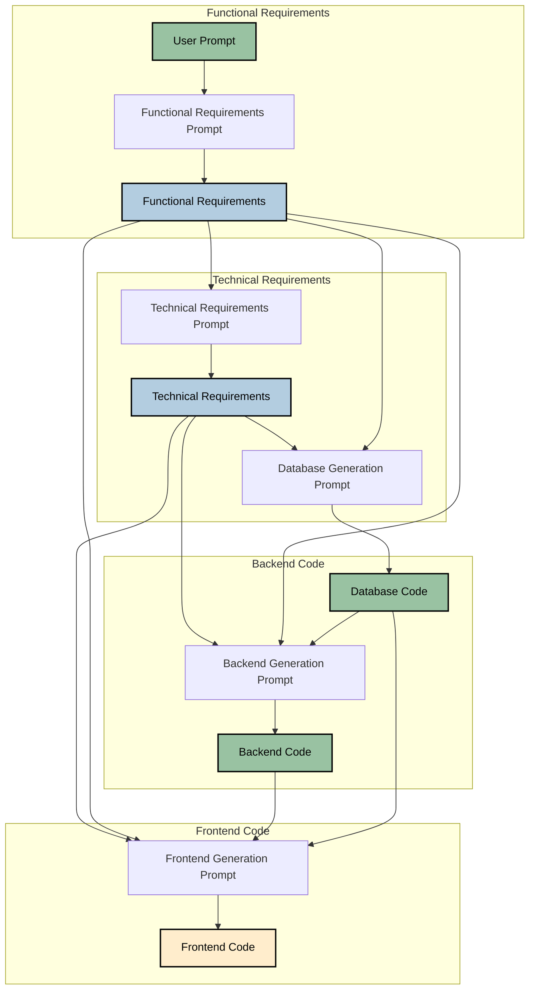

# oneShotCodeGen


A command-line tool that generates complete full stack web applications from a single prompt using AI.

**Update 01/12/2024:** After creating and testing 100+ webapps, sharing the results below with the latest prompt versions used to generate the apps.

See [examples section](examples/README.md) for detailed results and analysis of final 10 generated apps.


## Purpose


### Problem
 AI models like ChatGPT/Claude/Cursor struggle to create accurate fullstack webapp from scratch. They are not bad at coding but get confused due to following reasons:-
 
- **Models make a lot of assumptions about implementation details which are never recorded**
 
  - They assumes details like user flows,screen layout, technologies stack etc which are not documented and lost in its decision making process
  - When you prompt the model to build on top of its previous output, it doesn't have the relevant context , makes new assumptions and creates inaccurate
   
- **As the changes become complex over the chat window it struggles on what to refer to and what not**
 
  - The Code quality drops rapidly and the model needs a lot of hand holding in what past context to take in and what not
  - Details regarding changes aren't properly tracked or incorporated in the context. (Although cursor has tried to solve this)


### Solution
We try to solve these problems by dividing the code generation process into distinct steps/phases where we force the AI to document and save all of its assumptions and subsequent code details.

To increase its accuracy we pass custome prompts and also pass the output of previous steps as context to generate the next response. 

You just give it a simple prompt like "Create an expense management tool" and it will set up the whole project with relevant code and requirement docs. We explain the chart below on how it takes user prompt and creates the app:



Each phase uses specialized prompts that focus on specific aspects of the application to ensure the best output is generated.\n
We also have different versions of prompts for you to try out and see which leads to highest accuracy code.

## Features


- Multiple prompt versions for requirements and code generation
- Support for both OpenAI and Anthropic models
- Flexible code generation strategies:
  - use our test pipeline config to create full project
  - Create your own prompot chaings by adding/removing steps in pipeline config
- Rich console output with progress tracking
- Organized project structure with documentation, all files are created in a separate folder called "/generated_project"


## Installation


1. Clone the repository:
   ```bash
   git clone https://github.com/vivek100/oneShotCodeGen.git
   cd oneShotCodeGen
   ```


2. Create a virtual environment:
   ```bash
   python -m venv venv
   ```


3. Activate the virtual environment:
   - **Windows**:
     ```bash
     venv\Scripts\activate
     ```
   - **Unix/MacOS**:
     ```bash
     source venv/bin/activate
     ```


4. Install the required packages:
   ```bash
   pip install -r requirements.txt
   pip install -e .
   ```


## Configuration


Create a `.env` file in the root directory with your API keys:
```
OPENAI_API_KEY=your_openai_key
ANTHROPIC_API_KEY=your_anthropic_key
PROJECT_OUTPUT_DIR=./generated_projects
```

## Usage


The tool provides various options for customization:
> make sure you have python, node, npm installed in your system and added to PATH variables

- Basic usage with default versions:
  ```bash
  python -m ai_code_generator_cli.cli "Create a todo app"
  ```


- Specify versions for each component:
  ```bash
  python -m ai_code_generator_cli.cli "Create a todo app" \
  --mode setup \
  --pipeline oneShotCodeGenV1 \
  --model anthropic
  ```


- If you don't specify it will use openai, but to use Anthropic's Claude instead of GPT-4:
  ```bash
  python -m ai_code_generator_cli.cli "Create a todo app" --model anthropic
  ```

- Generate only requirements and code:
  ```bash
  python -m ai_code_generator_cli.cli "Create a todo app" --mode setup --pipeline requirementsV1 --model anthropic
  ```


### Options


- `--mode`: Processing mode
  - `requirements`: Generate only requirements documents
  - `code`: Generate requirements and code (without creating files)
  - `full`: Generate requirements, code, and create project files
  - `step`: Generate requirements, code, and create project files in steps
  - `setup`: To access new version of prompts to create full project
- `--pipeline`: Pipeline to execute in step mode
  - `oneShotCodeGenV1`: Use our latest and best version of prompts to create full project
  - `requirementsV1`: Use our latest and best version of prompts to create requirements only
- `--model`: AI model provider (openai/anthropic)
- `--func-version`: Version of functional requirements prompt (v1/v2/v3)
- `--tech-version`: Version of technical requirements prompt (v1/v2/v3)
- `--code-version`: Version of code generation prompts (v1/v2/v3)
- `--backend-template`: Path to backend code template file (needed for code version v3 only)
- `--frontend-template`: Path to frontend code template file (needed for code version v3 only)


## Output Project Structure


All code and llm outputs are saved in generated projects follow a consistent structure:

```
generated_projects/
└── project_YYYYMMDD_HHMMSS_uniqueid/
    ├── docs/
    │   ├── functional_requirements.md
    │   └── technical_requirements.md
    ├── generatedCode/
    │   ├── backend/
    │   │   └── (All backend code for API and DB)
    │   └── frontend/
    │       └── (All frontend code)
    ├── project_summary.md
    └── outputCode/
        ├── backend/
        │   └── output.txt
        └── db/(If we are generating db code separately)
        |   └── output.txt
        └── frontend/
            └── output.txt
```


### How to make the most of this tool
1. Full project mode: 

    - Generates functional requirements doc, technical implementation doc, database setup, backend code and frontend code. 
    - It then creates the project files in a folder and installs all the dependencies. You just need to start the backend and frontend server with "npm start"
    - You then open this folder in an ai code editor like cursor to edit further. The accuracy of code generated by cursor is very high because all the assumptions made via ai are present in the folder and cursor has all of that in its context.

2. Requirements only mode: 

    - Generates functional requirements doc, technical implementation doc. 
    - Then open the folder in an ai code editor like cursor and based on the on details ask cursor to create the code.


3. Changing the tech stack: 

    - You can edit the prompts to change what tech stack you want for your application, currently all apps are created in react frontend, sqlite for DB and nodejs/express for backend. Prompts can be found in following folder "/ai_code_generator_cli/prompts/requirements_prompts.py"(tech stack is mentioned here)
    - You can also add/remove steps in pipeline config to change the flow of the project.


## Examples

    - Find the examples in "/selectedProjects" folder
    - We have 10 projects with different requirements to test the accuracy of the tool

| App Name | Prompt | Model | Functionality Coverage | Code Setup | Backend Errors | Frontend Errors | Prompt Changes |
|----------|---------|--------|----------------------|------------|----------------|-----------------|----------------|
| Team Expense Portal | Create a Team expense management portal | Gpt4o | Full | No Issues | Auth was messed up, Mock Data seeding error, DB relations were messed up | Login and auth was messed, UI is not great looking | |
| Onboarding Portal | Develop a tool to manage the onboarding process for new hires, including tasks, document submission, and training progress | Claude | Full | No Issues | Mock data seeding had issues | Header section not aligned for all pages, Post login route messy and user data not set correctly | Updated prompt to ensure DB is not messy |
| Leave Management Portal | Build a tool for employees to request leaves, managers to approve them, and HR to track leave balances | Claude | Full | No Issues | No error | Form UI library syntax error, Infinite loop in "/" route, Post auth user data object wrong | |
| Performance Review Portal | Develop a tool for managing employee performance reviews, including self-reviews, peer reviews, and manager feedback | Claude | Full | Small issue model returned run command with install commands | No error | Main Route from login to dashboard messed, Post auth user data object not saved correctly, Headers not consistent | |
| Team Pizza Tracker | Develop a portal for a team to track their favourite pizza places, reviews and the number of pizza slices eaten | Claude | Partial - missed code to give review for pizza places | No Issues | No error | Main Route from login to dashboard messed, Post auth user data object not saved correctly, Headers not consistent, Old Syntax for query selector, Syntax issue with MUI table library | |
| Show Recommendation Tracker | Develop a tool for friends to track movie and show recommendations along with ratings from the friends | Claude | Partial - missed backend and frontend API code for admin page as token limit reached for backend code | No Issues | No error | Routes messed up for login and main page, Post Auth user data object Issue, Syntax of MUI table issue while showing row data | |
| Job Applications Tracker | Develop a job application tracker system for a company to track employees from application submission to final decision | Claude | Full | No Issues | No error | No error | Updated frontend prompt to avoid the common mistakes of auth, mui table, and routes |
| Mom restaurant inventory and sales tracker | Develop a portal for a momo dumpling shop to track its inventory and sales | Claude | Partial - missed backend and frontend API code as token limit reached for backend code | No Issues | No error | No error, but none of the APIs were connected as there were no backend APIs | |
| Model Rocket build tracker | Build a portal to track my progress on building my first model rocket | Claude | Partial - missing create project tasks and project view screens | No Issues | No error | Small error missing tags in one file | |
| Prompt Repository Portal | Develop a Webapp to track my prompts for various ai models, they can be single or chained prompts, with an option to rate them across various parameters | Claude | Partial - missed backend and frontend API code for admin page as token limit reached for backend code, Create Chain is missing | No Issues | No error, seeding mock data issue | Small error used old syntax for import in jwtDecode, Route error after login not moving to dashboard | |

## Contributing


Contributions are welcome! Please feel free to submit a Pull Request.


## License


This project is licensed under the MIT License - see the LICENSE file for details.


## Note


Make sure to include a `.gitignore` file to prevent sensitive information and unnecessary files from being uploaded to GitHub.


